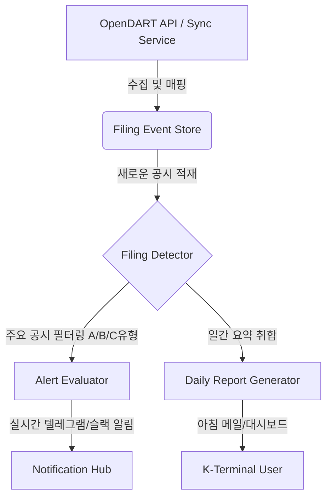

# Filing Event Engine

본 문서는 K-Terminal의 공시 이벤트 처리 엔진(`Filing Event Engine`)의 상세 사양 및 아키텍처를 기술합니다.

## 1. 목적 (Purpose)

공시 정보는 재무 비율, 자산 유동성, 지배 구조 등 기업의 핵심 펀더멘털 변화를 적시에 알 수 있는 가장 공신력 있는 데이터 소스입니다. K-Terminal은 가격/기술 팩터뿐만 아니라 공시 이벤트를 실시간/주기적으로 수집 및 정형화하여 다음을 달성하고자 합니다:
1. 개별 주식 화면에서 가장 최근의 공시 목록을 지연 없이 노출.
2. 향후 재무 팩터 백테스트 수행 시 Point-in-Time 데이터 제공을 위한 정밀한 공개 일시(`dataAvailableAt`) 매핑.
3. 주요 공시 이벤트 발생 시 실시간 알림(Alert) 및 일간 리포트(Daily Report)에 통합 반영.

## 2. OpenDART List Item Mapping Rules (맵핑 규칙)

OpenDART 공시검색 API 응답 리스트 항목인 `OpenDartDisclosureListItem`은 다음과 같이 정규화된 `FilingEvent` 도메인 포맷으로 변환됩니다:

- **ID**: `OpenDART_${receiptNo}` 형식으로 고유 식별자 설정.
- **receiptNo**: OpenDART에서 발급하는 공시접수번호 `rcept_no`를 그대로 맵핑.
- **filingUrl**: DART 공식 웹사이트 원문 보기 링크로 매핑.
  `https://dart.fss.or.kr/dsaf001/main.do?rcpNo=${receiptNo}`
- **receiptDate**: 접수일자 `rcept_dt` (YYYYMMDD 포맷).
- **dataAvailableAt**: 시장 개장 시점에 맞춰 `receiptDate`를 KST 오전 9시 정각(`YYYY-MM-DDT09:00:00+09:00`) 타임스탬프로 변환하여 PIT 분석의 정밀성을 확보.
- **stockCode**: `stock_code`가 존재하고 공백이 아닌 경우 6자리 문자로 클렌징하여 저장. 상장사가 아닌 경우 `null` 처리.

## 3. Deduplication Policy (중복 처리 및 보존 정책)

- **ReceiptNo 기준 중복 방지**: 동일한 `receiptNo`를 가진 공시가 여러 번 수집되더라도 파일 스토어([filing-event-store.ts](file:///Volumes/무제/jusik/src/server/filings/filing-event-store.ts))가 병합 과정에서 중복 적재를 완전히 차단합니다.
- **파일 분리 저장**:
  - `data/filings/events.json`: 전체 유니버스의 공시 이벤트를 하나의 인덱스로 관리 (최대 수천 건 수준).
  - `data/filings/latest-by-stock/{stockCode}.json`: 종목별로 최근 100개의 공시만을 신속하게 읽을 수 있도록 개별 파일에 캐싱. 이를 통해 브라우저 UI에서 특정 종목 상세 조회 시 속도를 비약적으로 향상시킵니다.

## 4. Future Alert & Daily Report Integration (향후 연동 아키텍처)

공시 이벤트 엔진은 향후 알림 및 리포트 서비스와 다음과 같이 연동될 예정입니다:

- **Filing Detector**: 새로 적재된 공시 중 대분류(`disclosureType`)가 주요사항보고(`B`), 발행공시(`C`) 등 투자 의사결정에 직결되는 공시를 선별 감지.
- **Daily Report Generator**: 매일 장 시작 전 발행되는 일간 리포트에 해당 종목의 전일 공시 요약을 바인딩하여 제공.
